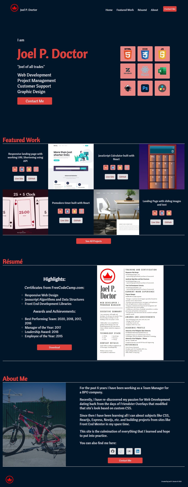

# Personal Portfolio

This is my personal portfolio website, built with all the knowledge I have gained so far and will be updated with knowledge I gain in the future. It has a contact form with reCaptcha and Google Analytics set-up so I can see website stats.

## Table of contents

- [Overview](#overview)
  - [The challenge](#the-challenge)
  - [Screenshot](#screenshot)
  - [Links](#links)
- [My process](#my-process)
  - [Built with](#built-with)
  - [What I learned](#what-i-learned)
  - [Continued development](#continued-development)
  - [Useful resources](#useful-resources)
- [Author](#author)
- [Acknowledgments](#acknowledgments)

## Overview

### The challenge

Users should be able to:

- View the optimal layout for the site depending on their device's screen size
- Download my Resume
- Contact me using the contact form after passing the reCaptcha verification
- Navigate to a page with all projects I have built
- Navigate to a page with more information about a specific project

### Screenshot



### Links

- Live Site URL: http://www.joeldoctor.com

## My process

### Built with

- Semantic HTML5 markup
- CSS custom properties
- SCSS
- Flexbox
- Grid
- Mobile-first workflow
- [React](https://reactjs.org/) - JS library
- [Next](https://nextjs.org/) - React Framework
- [Vercel](https://vercel.com/)

### What I learned

This is the first project I built with Next, so I learned a lot about dynamically generated pages.

I also learned about how to handle markdown files for use in each individual project page:

```js
export const getStaticProps = async (context) => {
  const files = fs.readdirSync(path.join("markdown"));
  const posts = files.map((fileName) => {
    const readContent = fs.readFileSync(
      path.join("markdown", fileName),
      "utf-8"
    );
    return { fileName, readContent };
  });

  const currentProject = DATA.filter(
    (items) => items._id === parseInt(context.params.id)
  );
  const currentPost = posts.filter(
    (item) => item.fileName === currentProject[0].readme
  );
  return {
    props: {
      project: currentProject[0],
      content: currentPost[0].readContent,
    },
  };
};

export const getStaticPaths = async () => {
  const ids = DATA.map((item) => item._id);
  const paths = ids.map((id) => ({ params: { id: id.toString() } }));
  return {
    paths,
    fallback: false,
  };
};
```

I also learned tried out using hover to make an element appear:

```scss
.hover_link {
  display: flex;
  justify-content: center;
  align-items: center;
  position: absolute;
  background-color: var(--color-bg);
  height: fnc.rem(40);
  width: fnc.rem(144);
  bottom: fnc.rem(-56);
  left: fnc.rem(84);
  visibility: hidden;
  opacity: 0;
  padding-bottom: 0.5rem;
  transition: all 350ms ease;
  transition-delay: 200ms;
  border-radius: 0 0 fnc.rem(10) fnc.rem(10);
}
.stacked_link:hover .hover_link {
  visibility: visible;
  opacity: 1;
}
```

Setting up Google Analytics for Next was also a learning experience:

```js
<script
  async
  src={`https://www.googletagmanager.com/gtag/js?id=${process.env.NEXT_PUBLIC_GOOGLE_ANALYTICS}`}
/>
<script
  dangerouslySetInnerHTML={{
    __html: `
  window.dataLayer = window.dataLayer || [];
  function gtag(){dataLayer.push(arguments);}
  gtag('js', new Date());
  gtag('config', '${process.env.NEXT_PUBLIC_GOOGLE_ANALYTICS}', {
    page_path: window.location.pathname,
  });
`,
  }}
/>
```

### Continued development

I want to convert this to a Full Stack website eventually to implement some kind of "wall" where visitors can leave comments and it will be stored into a database.

Implementing videos on hover for my featured projects and also on the individual project pages is also something I am figuring out.

The Featured Work section also might get tabs to navigate between different featured work in different categories.

Some non-web development projects also will be added eventually, once I figure out which ones are worth adding.

### Useful resources

- [Next.js Crash Course 2021 by Traversy Media](https://youtu.be/mTz0GXj8NN0) - A great starting point with everything needed to learn how to set-up a Next Project.
- [Next.js in 100 Seconds // Plus Full Beginner's Tutorial by Fireship](https://youtu.be/Sklc_fQBmcs) - Another great starting point in a more compact time frame.
- [Next.js Documentation](https://nextjs.org/docs) - Really helpful documentation.
- [Integrating reCAPTCHA with Next.js by Prateek Surana](https://prateeksurana.me/blog/integrating-recaptcha-with-next) - Helped with configuring the reCaptcha in the Contact page.
- [Add Google Analytics to your Next.js application in 5 easy steps by Marie Starck](https://mariestarck.com/add-google-analytics-to-your-next-js-application-in-5-easy-steps/) - Helped me set-up Analytics.

## Author

- Website - [Joel P. Doctor](https://www.joeldoctor.com)
- Frontend Mentor - [@kingwell47](https://www.frontendmentor.io/profile/kingwell47)
- Twitter - [@kingwell47](https://www.twitter.com/kingwell47)
- LinkedIn - [Joel P. Doctor](https://www.linkedin.com/in/joel-d-05854919/)

## Acknowledgments

Thanks to Ms. Jessica Chan (Coder Coder) and all the other YouTube creators making their knowledge available!
